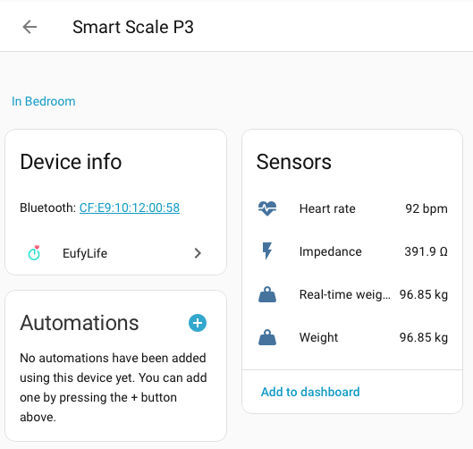

# EufyLife BLE Custom Component for Home Assistant

Custom component for [Home Assistant](https://www.home-assistant.io/) that extends the built-in EufyLife BLE integration with **impedance** and **heart rate** support for the Smart Scale P3 (T9150).



## Features

| Sensor | Models | Description |
| ------ | ------ | ----------- |
| Weight | All | Real-time and final weight in kg/lbs |
| Heart Rate | T9149, T9150 | Heart rate in bpm (new for T9150) |
| Impedance | T9150 | Body impedance in Ohms |

The impedance value is the raw bioelectrical impedance measurement from the scale's electrodes. The Eufy app uses this value together with your height, age, and gender to calculate body composition metrics (body fat %, muscle mass, BMI, etc.).

## Installation

### Manual

1. Copy the `eufylife_ble` folder into your Home Assistant `custom_components` directory:
   ```
   custom_components/
   └── eufylife_ble/
       ├── __init__.py
       ├── config_flow.py
       ├── const.py
       ├── icons.json
       ├── manifest.json
       ├── models.py
       ├── sensor.py
       ├── strings.json
       └── translations/
           └── en.json
   ```

2. Install the forked library (via SSH/Terminal add-on):
   ```bash
   pip install git+https://github.com/cubinet-code/eufylife-ble-client@main
   ```

3. Restart Home Assistant.

### Setup

After restarting, the integration should automatically discover your scale when you step on it. If you already have the built-in EufyLife BLE integration configured, the custom component will override it and the new sensors (heart rate, impedance) will appear automatically.

## How it works

The T9150 sends all measurement data via BLE advertisements (no GATT connection needed). The advertisement data (23 bytes, company ID `0xCF64`) contains:

- **Weight**: bytes 12-13 (uint16 LE / 100, in kg)
- **Heart rate**: byte 15 (uint8, in bpm) — present in the final packet
- **Impedance**: bytes 17-18 (uint16 LE / 10, in Ohms) — present after body composition measurement

## Related

- Library fork: [cubinet-code/eufylife-ble-client](https://github.com/cubinet-code/eufylife-ble-client)
- Upstream library PR: [bdr99/eufylife-ble-client#11](https://github.com/bdr99/eufylife-ble-client/pull/11)
- P3 support issue: [bdr99/eufylife-ble-client#3](https://github.com/bdr99/eufylife-ble-client/issues/3)
